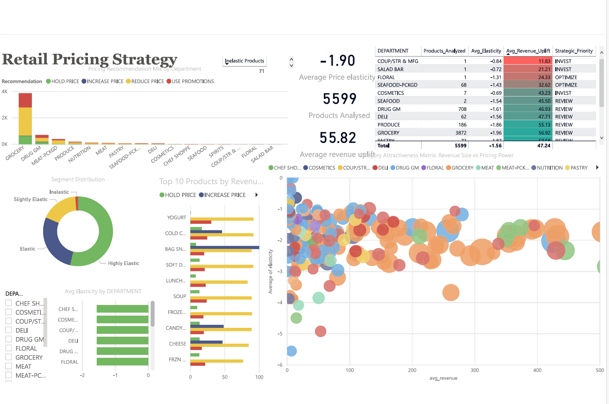

# Retail Pricing Strategy & Portfolio Intelligence Tool

**Tools:** Python · Streamlit · Plotly · Scipy · Statsmodels · Power BI  
**Data:** Dunnhumby "The Complete Journey" — 2.5M+ retail transactions  

---

## Power BI Dashboard



---

## Overview

An end-to-end pricing intelligence system built on real consumer transaction data. The tool estimates product-level price elasticities of demand, identifies revenue optimization opportunities, and frames the retail portfolio through a strategic asset evaluation lens — mapping categories across pricing power and revenue dimensions to generate invest/optimize/divest recommendations.

---

## Methodology

### 1. Data Preparation
- Integrated transaction, product, and promotional data across relational tables
- Aggregated 2.5M+ transactions to product-week level (price, quantity, revenue)
- Filtered products with fewer than 10 weeks of data or insufficient price variation

### 2. Price Elasticity Estimation
Log-log OLS regression at the product-week level:

```
log(Quantity) = α + β · log(Price) + ε
```

The coefficient β is the price elasticity directly. Only statistically significant estimates (p < 0.05) within an economically plausible range (−10 to +5) are retained — 5,599 products.

### 3. Segment Classification

| Elasticity Range | Segment | Recommendation |
|---|---|---|
| > −0.5 | Inelastic — Price Insensitive | INCREASE PRICE |
| −0.5 to −1.0 | Slightly Elastic | HOLD PRICE |
| −1.0 to −1.5 | Elastic — Price Sensitive | USE PROMOTIONS |
| < −1.5 | Highly Elastic | REDUCE PRICE |

### 4. Revenue Optimization
Scipy bounded optimization finds the revenue-maximizing price for each product under the constant elasticity demand assumption:

```
Revenue(P) = P × Q₀ × (P/P₀)^ε
```

Optimal price constrained to ±50% of current price. Revenue uplift capped at 100% to remove optimizer artifacts.

### 5. Strategic Portfolio Assessment
Products mapped onto a Category Attractiveness Matrix:
- **X-axis:** Revenue size (log scale)
- **Y-axis:** Pricing power (elasticity; less negative = stronger)
- **Bubble size:** Revenue uplift opportunity

Quadrants: Core Assets (Protect) · Growth (Invest) · Mature (Optimize) · Weak (Review)

---

## Streamlit Dashboard — 5 Panels

| Tab | Description |
|---|---|
| Portfolio Overview | Elasticity by department, segment distribution, summary table |
| Product Explorer | Department/product selector, live price simulator, revenue curve |
| Pricing Opportunities | Top 20 products by uplift potential, color-coded recommendations |
| Demand Curves | Fitted demand curve with actual weekly scatter, current vs optimal price |
| Strategic Portfolio | Category Attractiveness Matrix, value creation by department, executive summary |

---

## Power BI Dashboard — Key Visuals

| Visual | Description |
|---|---|
| KPI Cards | Products Analyzed · Avg Elasticity · Avg Revenue Uplift · Inelastic Products |
| Recommendation Mix | Stacked bar by department — HOLD / INCREASE / REDUCE / USE PROMOTIONS |
| Segment Distribution | Donut chart — Inelastic / Slightly Elastic / Elastic / Highly Elastic |
| Avg Elasticity by Department | Horizontal bar chart sorted by elasticity |
| Top 10 Products by Uplift | Horizontal bar, colored by recommendation type |
| Category Attractiveness Matrix | Scatter plot — Revenue Size vs Pricing Power, bubble = uplift opportunity |
| Department Summary Table | Sortable table with conditional formatting on revenue uplift |

---

## Files

| File | Description |
|---|---|
| `pricing_project.py` | Full data pipeline — cleaning, elasticity, optimization, export |
| `dashboard.py` | Streamlit dashboard |
| `retail_pricing_dashboard.pbix` | Power BI dashboard file |
| `elasticity_output.csv` | 5,599 products with elasticity, segments, optimal prices |
| `weekly_output.csv` | Product-week aggregated dataset (900K rows) |
| `dept_summary.csv` | Department-level strategic summary (16 departments) |

---

## Data Source

Dunnhumby — "The Complete Journey"  
Available on Kaggle. Files used: `transaction_data.csv`, `product.csv`, `campaign_table.csv`

---

## Limitations

- Constant elasticity assumption (log-log OLS) approximates the true demand curve; elasticity likely varies across the price range
- Elasticity estimates are cross-sectional averages — do not account for seasonality or promotional effects
- Revenue optimization ignores cross-price effects between substitute products

---

## How to Run

```bash
pip install streamlit plotly statsmodels scipy pandas numpy

streamlit run dashboard.py
```
